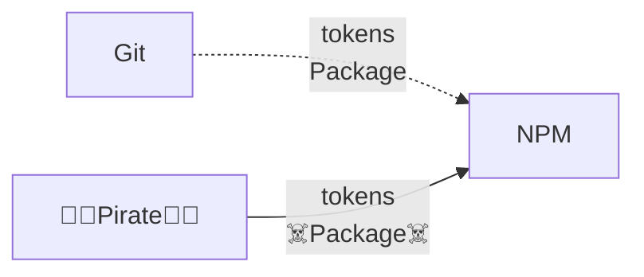
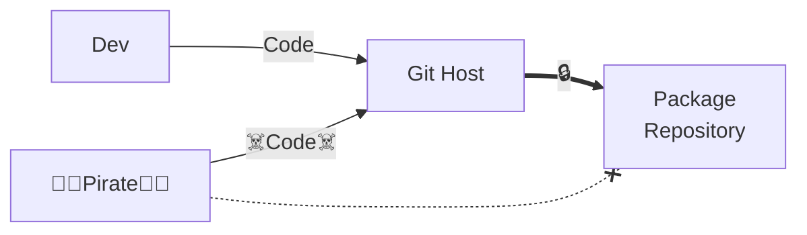

# Current Supply Chain Attacks

Bypass the source git repo to publish malicious packages

---
layout: two-cols-header
level: 2
---

### OpenSSF Trusted Publishing

::left::

- Uses Short-Lived OIDC Tokens
- Allows Deactivating Traditional Tokens
- Allows MFA validations
- Limits Packages Origin to a Single Provider

::right::

::bottom::

Another cool part of SigStore?
It offers the same flows for signing
- git commit
- container

---
layout: two-cols-header
level: 2
---

# Some predictions

::left::

Expect

<v-click>

- More Attacks against git?

</v-click>
<v-click>

- More Attacks targetting devs?

</v-click>
<v-click>

- New Phishing Attacks?

</v-click>

::right::

<v-click>

</v-click>