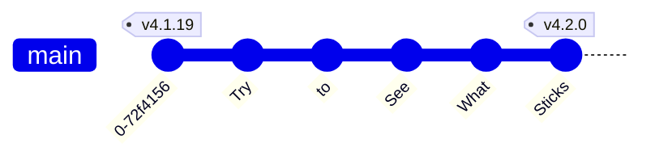
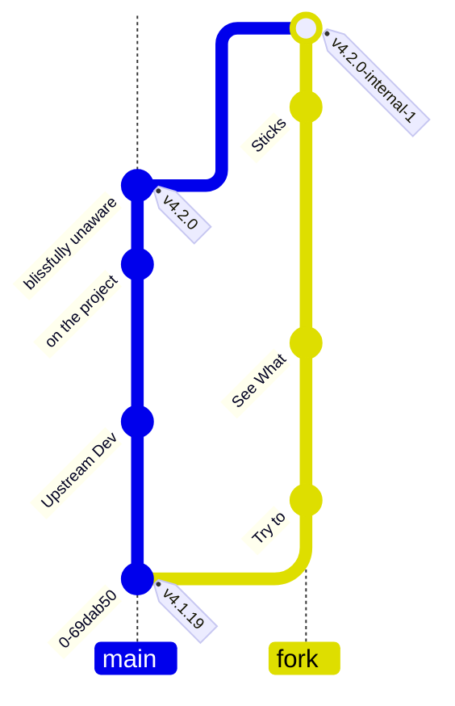

# What's my issue with git?

## Git Push AuthN !== Git AuthN

---
layout: two-cols-header
level: 2
---

# Moonlight project

::left::



::right::
Commit:
- Authors: 1
- Committers: 1
- Pushers: 1

::bottom::

It all checks out, right?

---
layout: two-cols-header
level: 3
---

# Forked Open Source Project

::left::



::right::

On My Project:
- Authors: &infin; + 1
- Committers: &infin; + 1
- Pushers: 1

<br/>

### Suddenly, you're pushing someone else's commits!

<!-- If you look at the Linux Kernel Development that workflow is an integral part of how they work -->

---
level: 2
---

## So I can push someone else's commits...

### Surely, I Can't commit as someone else?

> $ docker run -it --rm -v $(pwd):/demo -w /demo alpine sh

``` {all|2,3|4,6|7,8|all}
# apk add git
# git config user.name "Gilles Bélanger"
# git config user.email "Gilles.Belanger.ORFO@assnat.qc.ca"
# echo "X5O!P%@AP[4\\PZX54(P^)7CC)7}\$EICAR-STANDARD-ANTIVIRUS-TEST-FILE!\$H+H*" > eicar

# chmod +x eicar
# git add eicar 
# git commit -m "Malicious Commit"
# exit
```

> $ git log --format=oneline  
> $ git push


<!--  Demo: Git Commit Impersonation -->

---
layout: center
level: 3
---

## Want to retroactively blame someone else?

## Check out Jay Phelps' git-blame-someone-else!

https://github.com/jayphelps/git-blame-someone-else

---
layout: two-cols-header
level: 1
---

# Why Should I Care?

::left::

No Validations:

<ul>
  <li>❌ Commit Author</li>
  <li>❌ Commit Committer</li>
  <li>❌ Commit Integrity
    <ul>
      <v-click>
        <li>✅ Commit History</li>
      </v-click>
      <v-click>
        <li>❌ Force Push</li>
      </v-click>
    </ul>
  </li>
</ul>

<v-click>

Sprinkle in a dash of malice?

</v-click>

::right::

<v-click></v-click>

---
layout: section
level: 2
---

# [Hanlon's Razor](https://en.wikipedia.org/wiki/Hanlon's_razor)

#### Never attribute to malice that which is adequately explained by stupidity
