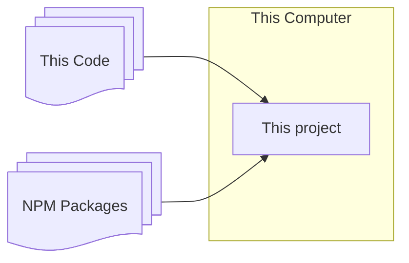
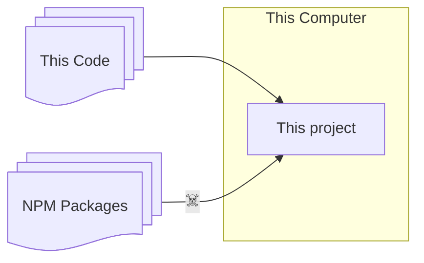

---
# You can also start simply with 'default'
theme: seriph
# some information about your slides (markdown enabled)
title: Git Commit Signing
hideInToc: true
info: One small step for Dev. One giant leap for Integrity.
# apply unocss classes to the current slide
class: text-center
# https://sli.dev/features/drawing
drawings:
  persist: false
# slide transition: https://sli.dev/guide/animations.html#slide-transitions
transition: none
# enable MDC Syntax: https://sli.dev/features/mdc
mdc: true
# open graph
# seoMeta:
#  ogImage: https://cover.sli.dev
---

# Git Commit Signing

A Self-Defense Practice that doesn't imply MAD?

---
hideInToc: true
layout: two-cols-header
---

# Scene 1

::left::

## Act 1

- Outage Over
  - Company Lost
    - Money
    - Reputation
    - SLAs
- Investigation reveals a malicious commit
  - eg: logic bomb
- Git Commit author is **you**
  - You never wrote that code

::right::

<v-click>

## Act 2
### Managers

Who fires on the spot?

</v-click>

<v-click>

### Devs

How do you defend yourself?

</v-click>

<v-click>

How do you prove Git is _wrong_ ?

</v-click>

---
hideInToc: true
---

# ToC

<Toc minDepth="1" maxDepth="1" />

---

# $ whoami

- Gabriel Fournier
- 15 years DevSecOps
- Sign All My Commits Since ~2021
- Laid off in 2023
    - Crashed Prod on the day I was laid off
        - Accidentally!

---
hideInToc: true
layout: center
---

# Disclaimers

## I am not a lawyer

## I am not your lawyer

## This is  Not Legal Advice

---
hideInToc: true
layout: center
---

# Disclaimers

## Git Impersonation Attacks are shown as an educational aid only.

## Please replicate demos **responsibly**

---
src: ./pages/why-sign.md
hide: false
---

---
src: ./pages/personal-mitigations.md
---

---
src: ./pages/postmortem.md
---

---
src: ./pages/project-mitigations.md
---

---
image: /silver-bullet.jpg
layout: image
---

---
hideInToc: true
layout: end
---

# Thank You!

# Questions?

<PoweredBySlidev/>

---
hideInToc: true
---

# Supply Chain Attacks

---

# Supply Chain Attacks

---
hideInToc: true
---

# What About Insider Threat?

